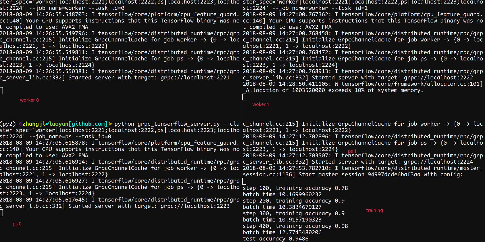

# 使用方法

Tensorflow的分布式训练需要启动集群，然后再进行训练任务的启动。

## 启动集群

Tensorflow的集群分为2种角色：worker和ps worker。Worker负责真正的计算，PS worker负责参数处理和同步。

### 启动worker

启动的命令如下

```bash
python grpc_tensorflow_server.py --cluster_spec='worker|localhost:2221;localhost:2222,ps|localhost:2223' --job_name=worker --task_id=0

python grpc_tensorflow_server.py --cluster_spec='worker|localhost:2221;localhost:2222,ps|localhost:2223' --job_name=worker --task_id=1
```

### 启动ps worker

```bash
python grpc_tensorflow_server.py --cluster_spec='worker|localhost:2221;localhost:2222,ps|localhost:2223' --job_name=ps --task_id=0
```

## 启动训练

启动命令如下：

```bash
python diss.py --data_dir /opt/corp.awcloud.com/ai-demo-scripts/data --ps localhost:2223 --worker_index 1 --ps_index 0
```

### 参数说明

上述运行集群的命令当中，`cluster_spec`指向的是本地，假设生产环境如下：

- worker
  - 192.168.1.1
  - 192.168.1.2
  - 192.168.1.3

- ps
  - 192.168.1.4
  - 192.168.1.5

所有的节点统一使用`2222`端口，则上述命令修改如下：

```bash
python grpc_tensorflow_server.py --cluster_spec='worker|192.168.1.1:2221;192.168.1.2:2222,192.168.1.3:2222,ps|192.168.1.4:2222,192.168.1.5:2222' --job_name=worker --task_id=0

python grpc_tensorflow_server.py --cluster_spec='worker|192.168.1.1:2221;192.168.1.2:2222,192.168.1.3:2222,ps|192.168.1.4:2222,192.168.1.5:2222' --job_name=worker --task_id=1

python grpc_tensorflow_server.py --cluster_spec='worker|192.168.1.1:2221;192.168.1.2:2222,192.168.1.3:2222,ps|192.168.1.4:2222,192.168.1.5:2222' --job_name=worker --task_id=2

python grpc_tensorflow_server.py --cluster_spec='worker|192.168.1.1:2221;192.168.1.2:2222,192.168.1.3:2222,ps|192.168.1.4:2222,192.168.1.5:2222' --job_name=ps --task_id=0

python grpc_tensorflow_server.py --cluster_spec='worker|192.168.1.1:2221;192.168.1.2:2222,192.168.1.3:2222,ps|192.168.1.4:2222,192.168.1.5:2222' --job_name=ps --task_id=1
```

在上面运行训练的命令当中，

- ps指向Tensorflow集群当中的ps worker的地址
- worker_index表示使用第几个worker进行训练
- ps_index表示使用第几个ps worker进行参数处理

如果按照生产环境，则可以使用如下的任何一个命令执行

```bash
python diss.py --data_dir /opt/corp.awcloud.com/ai-demo-scripts/data --ps 192.168.1.4:2222 --worker_index 1 --ps_index 0

python diss.py --data_dir /opt/corp.awcloud.com/ai-demo-scripts/data --ps 192.168.1.5:2222 --worker_index 1 --ps_index 1
```

请注意ps_index需要和集群构成的ps的顺序保持一致。

***请根据实际环境进行参数的修改***

例子的运行结果如图：

